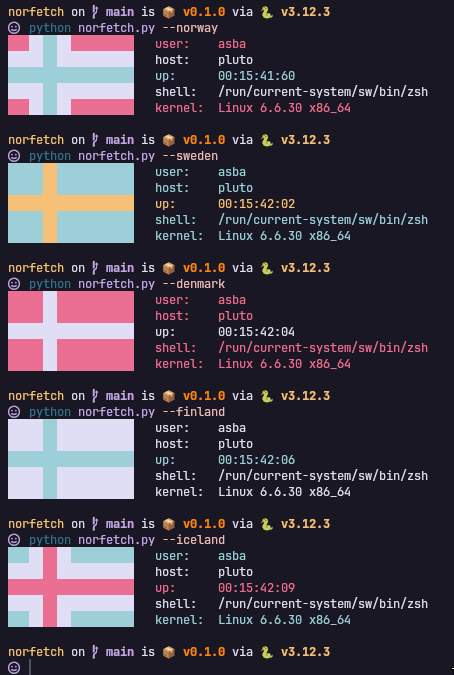
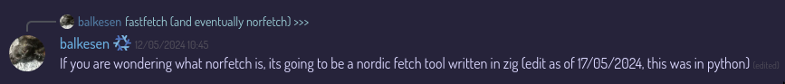

### This tool was made while `balkenix` was still my identity.
---

<center>
  <h3>norfetch 🇳🇴🇸🇪🇩🇰🇫🇮🇮🇸</h3>
  <p>The Python-based system fetch made by the sole reason of swaying your flag of the north on your rice!</p>
  
</center>

---

### why?



---

### installing on nix

add this repo as an input in your flake.nix:

```nix
inputs = {
  norfetch = {
    url = "github:balkenix/norfetch";
    inputs.nixpkgs.follows = "nixpkgs";
  };
};
```

and add the package:

```nix
# home.nix

home.packages = [
  inputs.norfetch.packages.${pkgs.system}.default
];
```

---

### norfetch-inspired projects

[bakafetch (unofficial name) by arutonee](https://gist.github.com/arutonee1/79a7990978c3a61405ae956ece811f8e)[^1]

[^1]: Author notes: _The one line neofetch destoyer_
